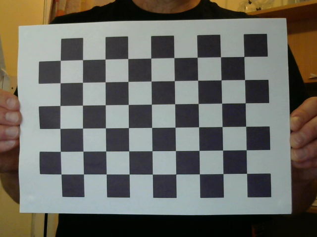

# Generate a custom dataset
## Camera Calibration
1. Prepare a chessboard shape as shown in the below image. The chessboard should be printed and fixed on a plain surface. It could also be displayed on a tablet. Take note of the following:
    1. Number of inner corners of the chessboard (in the example below it is 6x9). First count number of inner corners in one column (vertical), then count number of inner corners in one row (horizontal).
    2. The size of one square in the chessboard in millimeter.

2. Take multiple photos with your camera of the chessboard image. Make sure that camera auto focus is turned off before you shoot your photos. Take 10 to 20 images by moving around in the camera frame. Save the photos at a known folder.
3. Open cam_calib.py and provide the correct settings in lines 157 through 161 as follows:
    1. Line 157: Path to the saved calibration images folder.
    2. Line 158: Path to the desired folder to save calibration results.
    3. Line 159: Define the image format (.png, .jpg..etc).
    4. Line 160: Define the number of inner corners (vertical x horizontal).
    5. Line 161: Define the size of a square side in the chessboard in millimeter.
3. Open a terminal and run command <code> python cam_calib.py</code> which will generate and save a text file for the camera calibration matrix (projection matrix) with 12 elements in the desired folder specified in line 158.

## Shooting Images
1. Take photos of objects of interest using the calibrated camera. For KITTI dataset, there are 7000+ training images for 3 objects of interest. So take lots of images. Make sure autofocus in all cases is turned off.
2. Image files shall be all named in sequential 6-digit number order. For example, first image shall be named 000000.png, next one is 0000001.png and so on.

## Annotating Images
1. Each image must be annotated according to the KITTI dataset format shown below. You will need to create a separate folder (name it e.g. labels) and create a text file with the same image file name for each image. For each object in each image, we need to prepare the following info and place it in a space-separated line in the text file.

| Num elements | Parameter name | Description | Type | Range | Example | Remark |
|:------------:|:--------------:|:-----------:|:----:|:-----:|:-------:|:------:|
| 1 | Class names | Class to which the object belongs | String | N/A | Person, Car | Use unique class names for objects |
| 1 | Truncation | How much of the object has left image boundaries. | Float | 0.0, 1.0 | 0.0 | Not used. Can be set to 0.0 |
| 1 | Occlusion | Occlusion state (0=fully visible, 1=partly visible, 2=largely occluded, 3= unknown.) | Integer | [0,3] | 2 | Not Used. Can be set to 0 |
| 1 | Alpha | Observation Angle of object | Float | [-pi, pi] | 0.146 | Not used. Can be set to 0.0 |
| 4 | Bounding box coordinates: [xmin, ymin, xmax, ymax] | Location of the object in the image | Float(0 based index) | [0 to image width],[0 to image_height], [top_left, image_width], [bottom_right, image_height] | 100 120 180 160 | See next section for possible ways to get this info |
| 3 | 3D dimension | Height, width, length of the object (in meters) | Float | N/A | 1.65, 1.67, 3.64 | Measure the object |
| 3 | Location | 3D object location x, y, z in camera coordinates (in meters) | Float | N/A | -0.65,1.71, 46.7 | See next section for possible ways to get this info |
| 1 | Rotation_y | Rotation ry around the Y-axis in camera coordinates | Float | [-pi, pi] | -1.59 | See next section for possible ways to get this info |

2. For each image, there should exist a text file with the same 6-digit image name (in different folder). In each text file, there will exist one line for each object in the image, each line contain 15 space separated entries reflecting the above. Below is a sample:  <code>Pedestrian 0.00 0 -0.20 712.40 143.00 810.73 307.92 1.89 0.48 1.20 1.84 1.47 8.41 0.01</code>

## Annotating Tool
1. To build the above information, you need an annotator tool. Annotation is a separate subject, and there are many tools available online that can be used. You should be able to use Alp's annotator tool at <href>https://alpslabel.wordpress.com/2017/01/26/alt/</href>

## Putting the dataset together
1. When the above is completed, you should have the following:
    1. One folder containing images of objects of interest.
    2. One folder containing annotations / labels of the image files.
    3. One folder containing a calibration text file for the camera.
2. For the calibration file, we need to replicate the files and rename them in the same 6-digit number of each image. So that we have a triplet representing image (e.g. 000010.png), labels (e.g. 000010.txt), calibration (e.g. 000010.txt).
3. The last step will be to generate json files from all the above by opening a terminal and run the following command <code>python prep_data.py</code>.
4. Before we run the above command, we need to open the same file (prep_data.py) and edit the following:
    1. Lines 23 through 28: Paths to images folder, calibrations folder, labels folder and json annotations folder.
    2. Line 29: det_cats is a list of classes that we want to be detected.
    3. Line 30: cats is the whole list of classes in the dataset. It must be at least the same as det_cats.
